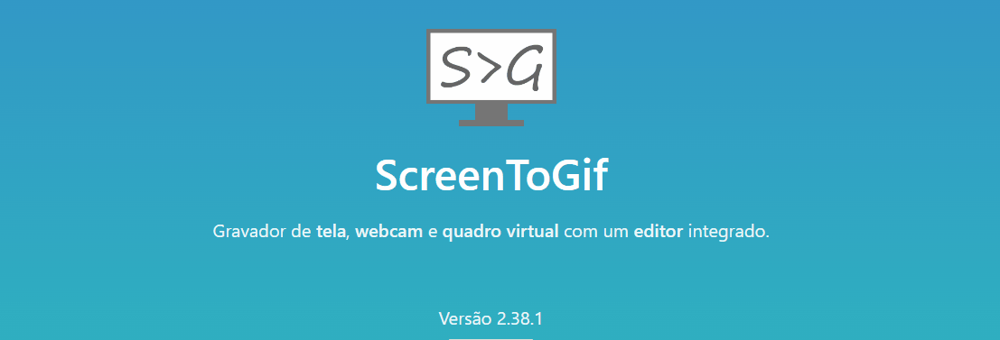

# Projeto com README
Um projeto de teste com um arquivo README.md 🥶

[](https://github.com/juancarlosTI)

# Tecnologias utilizadas
- HTML
- CSS
- JS

# Como utilizar

## Clonando o projeto

```
git clone https://github.com/juancarlosTI/repositorio-com-readme.git
```

## Acesse a pasta do projeto
Com o git Bash aberto na pasta do projeto digite:
```
cd repositorio-com-readme
```
